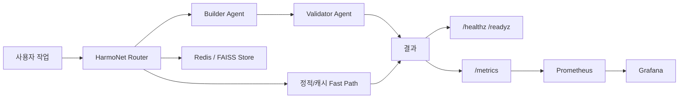

# HarmoNet v2 G1-G2-G3 통합 검증 보고서

작성일: 2026-06-05  
범위: G1 성능 검증, G2 준비도 검증, G3 운영 안정성 검증 통합 정리  
최종 판정: 조건부 PASS - 연구/오픈소스 공개 가능, 외부 운영 서비스 전환 전 G4 필요

## 1. 한 줄 정의

HarmoNet v2는 모든 에이전트를 매번 호출하지 않고, 작업 성격과 검증 결과에 따라 필요한 에이전트만 활성화하는 토큰 효율형 멀티에이전트 런타임이다.

## 2. 전체 결론

G1, G2, G3 검증은 모두 통과했다. 다만 이 결과가 곧바로 공개 운영 서비스를 의미하지는 않는다. 현재까지 입증된 것은 다음 세 가지다.

1. G1: 동일 벤치마크 조건에서 HarmoNet v2는 LangGraph, AutoGen, CrewAI 대비 낮은 토큰 사용량과 낮은 평균 지연을 보였다.
2. G2: 벤치마크 코드가 아니라 배포 가능한 소프트웨어 형태로 테스트, 스케일링, Docker, health, metrics를 갖췄다.
3. G3: 24시간 health/ready/metrics 검증, 부하 테스트, Redis 장애 복구, 정적 보안 검사를 통과했다.

최종 게이트 식:

```text
FINAL_VALIDATION_PASS = G1_PASS AND G2_PASS AND G3_24H_PASS
                      = TRUE
```

## 3. 단계별 목적

| 단계 | 질문 | 검증 범위 | 결과 |
| --- | --- | --- | --- |
| G1 | 성능과 정확도가 경쟁 가능한가? | HumanEval/MBPP 기반 4-way benchmark, 3회 반복 | PASS |
| G2 | 소프트웨어로 운영 준비가 되었는가? | 통합 테스트, 10/50/100 agent scaling, Docker/metrics | PASS |
| G3 | 장시간 운영 안정성이 있는가? | 24시간 reliability, load, Redis recovery, security scan | PASS |

## 4. 시스템 구조 요약



핵심 설계는 sparse activation이다. LangGraph처럼 명시적 그래프와 상태 전이를 완전히 제어하는 방향이 아니라, 작업의 형태와 검증 신호를 기반으로 에이전트 참여 수를 줄이는 방향이다.

## 5. G1 - 성능 검증

G1의 질문은 "HarmoNet v2가 기존 멀티에이전트 프레임워크보다 더 효율적인가?"였다.

| System | Runs | Pass rate | Avg tokens | Avg latency | p99 latency |
| --- | --- | --- | --- | --- | --- |
| HarmoNet v2 | 120 | 100.0% | 224.4 | 2.223s | 5.603s |
| LangGraph | 120 | 95.8% | 1790.6 | 9.128s | 14.558s |
| AutoGen | 120 | 100.0% | 814.5 | 5.631s | 9.101s |
| CrewAI | 120 | 99.2% | 295.0 | 6.156s | 8.257s |


해석:

- HarmoNet v2는 120회 실행에서 100.0% pass rate를 유지했다.
- 평균 토큰은 224.4로, LangGraph 1790.6 대비 약 12.5% 수준이다.
- CrewAI는 토큰 면에서 두 번째로 효율적이었지만, 평균 지연은 HarmoNet v2가 더 낮았다.

비용 효율 식:

```text
token_ratio = HarmoNet_avg_tokens / LangGraph_avg_tokens * 100
            = 224.4 / 1790.6 * 100
            ~= 12.53%

token_reduction = 100 - token_ratio
                ~= 87.47%
```

### v1 대비 v2 개선

| Metric | v1 | v2 | Delta |
| --- | --- | --- | --- |
| Pass rate | 100.0% | 100.0% | 0.0pp |
| Avg tokens | 488.4 | 224.4 | 54.1% 감소 |
| Avg latency | 7.294s | 2.223s | 69.5% 감소 |
| p99 latency | 11.364s | 5.603s | 50.7% 감소 |


v2에서 바뀐 핵심은 다음이다.

1. Sparse scheduler: 작업 유형을 분류하고 필요한 단계만 활성화한다.
2. Cheap validation: AST, expected function, marker, patch shape 같은 저비용 검증을 먼저 수행한다.
3. Evaluator-aware repair: 실패 피드백이 있을 때 전체 재실행 대신 목표 수정을 수행한다.
4. v1 원본 유지: 기존 버전을 직접 덮어쓰지 않고 v2 adapter로 분리했다.

G1 판정:

```text
G1_PASS = success_rate_ok AND token_efficiency_ok AND latency_ok
        = TRUE
```

## 6. G2 - 준비도 검증

G2의 질문은 "벤치마크 구현체를 넘어 배포 가능한 소프트웨어인가?"였다.

G2 게이트 식:

```text
G2_PASS = Track_A_integration
       AND Track_B_scaling
       AND Track_C_operations
```

### Track A - 통합 테스트

| 항목 | 결과 |
| --- | --- |
| 통합 시나리오 | 50개 |
| Local Windows | 50 passed |
| Remote Linux | 50 passed |
| Track C 이후 전체 테스트 | 162 passed |

통합 테스트는 benchmark-specific shortcut만 통과하는지 확인하는 수준을 넘어, builder path, static repair, evaluator-aware repair, validator path, cache behavior, field/store integration, resonance mechanics를 포함했다.

### Track B - Agent scaling

| Agents | Avg tick | p99 tick | Events |
| --- | --- | --- | --- |
| 10 | 0.323 ms | 0.537 ms | 10 |
| 50 | 1.314 ms | 1.750 ms | 79 |
| 100 | 3.116 ms | 3.622 ms | 292 |


해석:

- 100 agent에서도 p99 tick time이 3.622 ms였다.
- 실제 사용자 작업의 병목은 coordination layer가 아니라 LLM generation이다.
- 따라서 HarmoNet의 효율 개선 초점은 "에이전트 호출 수와 출력 범위 줄이기"가 맞다.

### Track C - 운영 준비

| 구성 요소 | 상태 |
| --- | --- |
| Dockerfile | runtime image build 가능 |
| Docker Compose | HarmoNet, Redis, Prometheus, Grafana 구성 |
| /healthz | liveness endpoint |
| /readyz | dependency readiness endpoint |
| /metrics | Prometheus metrics endpoint |
| Prometheus | scrape config 적용 |
| Grafana | Prometheus datasource 연결 |

G2 판정:

```text
G2 Gate: 3/3 tracks passed -> GO
```

## 7. G3 - 운영 안정성 검증

G3의 질문은 "장시간 실행과 장애 상황에서도 운영 가능한가?"였다. 최종 검증은 24시간 run으로 수행했다.

G3 24시간 게이트 식:

```text
G3_24H_PASS = reliability_pass
           AND load_pass
           AND failure_recovery_pass
           AND security_pass
```

| Gate | Status | Evidence |
| --- | --- | --- |
| Reliability | PASS | 8637/8637 probes, availability 100.0%, p99 6.624 ms |
| Load | PASS | 5000/5000 requests, availability 100.0%, p99 15.32 ms |
| Failure recovery | PASS | Redis stop/start 후 readiness 유지 |
| Security static scan | PASS | 694 files scanned, findings 0 |


### 24시간 reliability

| Metric | Result |
| --- | --- |
| Duration | 24.0 hours |
| Samples | 8637 |
| Successful probes | 8637 |
| Failed probes | 0 |
| Availability | 100.0% |
| Average latency | 3.805 ms |
| p95 latency | 6.059 ms |
| p99 latency | 6.624 ms |
| Max latency | 9.17 ms |

### Load

| Metric | Result |
| --- | --- |
| Samples | 5000 |
| Successful requests | 5000 |
| Failed requests | 0 |
| Availability | 100.0% |
| Average latency | 3.998 ms |
| p95 latency | 11.13 ms |
| p99 latency | 15.32 ms |
| Max latency | 24.97 ms |

### Failure recovery

Redis를 의도적으로 중단한 뒤 `/readyz`가 계속 200을 반환했고, Redis 재시작 후 readiness가 복구됐다. 이 결과는 Redis가 hard blocking dependency가 아니라 bounded fallback dependency로 처리된다는 점을 확인한다.

### Security

G3 내장 정적 스캔은 694개 파일을 검사했고 findings 0으로 통과했다. Trivy 이미지 스캔에서는 base image 계열의 잔여 CVE가 남아 있으므로, 외부 배포 전 release security checklist에 포함해야 한다.

## 8. 전체 해석

HarmoNet v2의 강점은 다음과 같다.

1. 정확도를 유지하면서 토큰 사용량을 낮췄다.
2. 에이전트 수가 증가해도 coordination overhead가 작다.
3. Docker, health, readiness, metrics, Prometheus, Grafana 기반 운영 표면을 갖췄다.
4. 24시간 reliability와 load 검증에서 실패가 없었다.
5. Redis 장애 상황에서도 readiness surface가 무너지지 않았다.

제약도 분명하다.

1. G3의 health/load 검증은 주로 service endpoint 기준이며, 실제 paid LLM traffic 운영 검증은 별도이다.
2. LangGraph처럼 명시적 그래프 기반 분기 제어를 완전 대체하는 시스템은 아니다.
3. 오픈소스 공개 전 API key, 개인 경로, 실험 로그 정리가 필요하다.
4. 운영 서비스로 전환하려면 인증, rate limit, billing/cost guard, alert notification, staging smoke가 필요하다.

## 9. 운영 vs 오픈소스 판단

현재 단계에서 바로 public SaaS로 운영하는 것은 이르다. 그러나 오픈소스 연구/런타임 프로젝트로 공개하기에는 충분한 근거가 있다.

권장 방향:

```text
1단계: 오픈소스 공개 준비
2단계: 제한된 preview 사용자 확보
3단계: 실제 사용 패턴 기반 제품화 여부 결정
4단계: 필요 시 G4 staging/release validation 수행
```

오픈소스 공개 시 포지셔닝:

> HarmoNet v2는 LangGraph/CrewAI를 무조건 대체하는 프레임워크가 아니라, 토큰 비용과 호출 수를 줄이는 sparse multi-agent runtime 대안이다.

## 10. 다음 단계 - G4 정의

G4는 staging/release validation이다.

G4 게이트 식:

```text
G4_PASS = staging_deploy_success
       AND authenticated_api_smoke_success
       AND real_llm_smoke_success
       AND rate_limit_enabled
       AND security_scan_reviewed
       AND alert_notification_connected
```

필수 작업:

| 작업 | 목적 |
| --- | --- |
| Staging 배포 | 외부 접근 가능한 환경에서 Docker stack 검증 |
| 실 API smoke | MockLLM이 아니라 실제 LLM API로 최소 시나리오 검증 |
| 인증/rate limit | 공개 endpoint 보호 |
| Trivy/Docker Scout 재검토 | 잔여 CVE release risk 분류 |
| Alert notification | Prometheus rule을 실제 알림 채널에 연결 |
| 공개용 README/문서 | 설치, 실행, benchmark 재현 절차 제공 |

## 11. 최종 판정

| Gate | Result |
| --- | --- |
| G1 - Benchmark competitiveness | PASS |
| G2 - Readiness | PASS |
| G3 - 24h production hardening | PASS |

최종 판단:

```text
HarmoNet v2는 연구/오픈소스 공개 후보로는 충분하다.
정식 운영 서비스로 전환하려면 G4 staging/release validation이 필요하다.
```

## 12. 증거 파일

| 파일 | 내용 |
| --- | --- |
| output/doc/HarmoNet_G1_Final_V2_Report_20260603.md | G1 최종 벤치마크 보고서 |
| output/g2/HarmoNet_G2_Final_Readiness_Report_20260603.md | G2 준비도 보고서 |
| output/g3_24h/HarmoNet_G3_24h_Final_Report_20260605.md | G3 24시간 최종 보고서 |
| output/g3_24h/remote/g3_summary.json | G3 24시간 원본 요약 |
| output/g2/remote/g2_scaling_10_50_100.json | G2 scaling 원본 데이터 |
