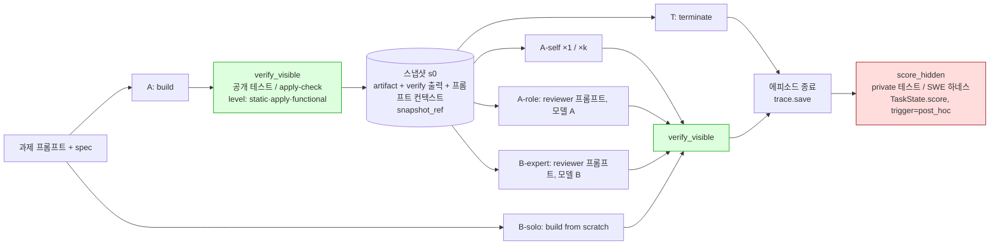

# 2~3주차 실험 설계 (C2 개정, 2026-09-13) — 실행하지 않음

상태: **사전 등록 대상.** 숫자로 적힌 통과 기준은 실행 전 고정하고 이후 바꾸지 않는다. C1(초안) 대비 바뀐 점은 각 절 머리에 표시.

## 0. 실험 질문

> 같은 작업 상태 s 에서 (i) 종료, (ii) 같은 에이전트의 자기 수정, (iii) 다른 모델의 전문가 추가 — 셋 중 어느 것이 나은지가
> **실제로 갈리는 경우가**, 예산을 맞춘 조건에서, 노이즈 바닥 위로 **존재하는가?**

방법 비교가 아니라 전제의 존재 검증이다(`related_work_week1.md` §3). 갈림이 없으면 REDEREF 대비 차이는 기여가 아니다.

**기준선의 의미 (C3 정정).** 비교 기준선은 "과제와 무관하게 하나의 arm 을 항상 고르는 최선 고정 전략"이다.
`oracle(과제별 최선 arm) − 최선 고정 전략` 의 gap 은 **상태 조건부 선택 일반의 가치 상한**이다 — 실행 후 산출물 상태로 조건화하든,
REDEREF·KABB 처럼 질의 유사도·이력으로 조건화하든, 어떤 조건부 선택도 과제별 최선 arm 보다 잘할 수 없다.
- 통과하지 못함(미확인) → 이 데이터로는 상태 조건부 방법이 고정 전략을 이긴다는 증거가 없다 → 방향 재검토 ("없음"이 아니라 "미확인").
- gap 있음 → 3주차에 상태 조건부 단순 라우터·밴딧(REDEREF 식 사후분포 포함)을 **같은 데이터**로 비교한다.
최선 고정은 **첫 기준선일 뿐 REDEREF 의 대리물이 아니며**, 이 게이트는 **필요조건 검사이지 차별성 증명이 아니다.**

## 1. 트랙과 태스크 (C2 개정)

| 트랙 | 풀 | 용도 | 규칙 |
|---|---|---|---|
| **functional 트랙 (주)** | **§1-A 프로브로 확정될 풀** — HumanEval 은 부적격(A 단독 96.3%, `evidence/week2/pool_probe.md`), MBPP 는 히든 없음(A7c). 후보: LiveCodeBench medium(2025-01 이후, public/private 분리), BigCodeBench-Hard | 탐색 + 확인 | 탐색용과 **확인용 ≥ 200 문제**를 인덱스로 동결(`evidence/week2/confirm_ids.json`). 확인용은 2주차에 생성·평가·열람 금지 |
| SWE 트랙 (보조) | SWE-bench Lite 0–29 | **탐색 파일럿만** | 가시 검증이 `apply` 수준이라 functional 신호 없음. 결과는 방향 참고 |
| SWE 보존 | SWE-bench Lite 30–59 | **외적 대조** | 30개는 Δ=10pp 를 검출할 검정력이 없다 — 통과/실패 판정에 쓰지 않고 functional 트랙 결론이 SWE 에서도 같은 방향인지만 본다 |

### 1-A. 풀 확정 절차 (사전 등록)
A 단독(`claude-haiku-4-5`, single, 1회) 히든 통과율이 **[30%, 70%]** 안이어야 채택. 후보마다 프로브 ≈ $0.5. 확정 전에는 arm 실험을 시작하지 않는다.
LiveCodeBench 는 난이도 층(easy/medium/hard)별로 통과율이 크게 갈리므로 층을 고정한 뒤 프로브한다.
EvalPlus(HumanEval+/MBPP+)는 **이번 작업 범위를 좁히기 위해** 보류 — LCB 가 모든 층에서 부적격일 때의 예정된 대안(`evidence/week2/pool_probe.md` 층 순서).

**전문가가 이길 과제만 사후 선별하지 않는다.** 집합은 인덱스로 고정, 생성 실패도 분모에 남는다.

## 2. 실험 arm (C2 개정: A-self×k 추가, 용어 정정)

A = builder 모델, B = A 와 다른 모델(§5). s0 = A 가 1회 build 하고 `verify_visible` 을 돌린 직후 상태 (§7 스냅샷).

| arm | s0 이후 행동 | 모델 | 프롬프트 | 무엇을 분리하는가 |
|---|---|---|---|---|
| **T** terminate | 없음. s0 의 산출물 제출 | — | — | 기준. A-solo 와 동일 실행 |
| **A-self** self_revise ×1 | A 가 산출물 + 가시 검증 출력을 보고 1회 수정 | A | builder | 자기 수정 1회 |
| **A-self×k** self_revise ×k | 같은 것을 예산이 허용하는 만큼 반복, **k = floor(b_cont / A 1회 비용 중앙값)** | A | builder | 같은 $ 로 자기 수정을 여러 번 — B-expert 와 **$ 매칭된** 자기 수정 |
| **A-role** expert-role | A 가 **reviewer 프롬프트**로 리뷰·수정 | A | reviewer | 전문가 프롬프트를 같은 모델에 옮긴 대조군 |
| **B-expert** expert_review | B 가 reviewer 프롬프트로 리뷰·수정 | B | reviewer | A-role 과의 차이 = **같은 reviewer 프롬프트에서 A→B 교체 효과** (C1 의 "모델 이질성의 순기여"를 이 표현으로 정정) |
| **B-solo** | B 가 처음부터 build (s0 미사용) | B | builder | 협업이 아니라 더 좋은 모델만 썼을 때 |
| A-solo | = T | A | builder | 표에 병기 |

전 arm 동일 정보·도구: 산출물, `verify_visible` 출력 전문, 과제 프롬프트, 같은 `spec`. 히든 정보 없음(§6). v1 키워드 repair·`eval_repair` 비활성.

## 3. 예산 (C2 개정: max_tokens 규칙, 거부율)

- **주 예산 = USD**, `harmonet/pricing.py` `prices_2026-09` 스냅샷. 토큰·wall_ms 는 항상 함께 보고.
- 계속 arm 의 추가 예산 상한 **b_cont** = B-expert 1회 호출 비용의 중앙값. **측정 순서:** 파일럿 **0회차**에서 B-expert 를
  `max_tokens=4096` 무상한으로 돌려 1회 비용 중앙값을 재고 → 그 값을 b_cont 로 고정 → **이후 모든 arm** 에 아래 max_tokens 규칙을 적용한다.
  B-solo 는 T + b_cont.
- **호출 규칙 (사전 등록):** 호출 직전 `max_tokens = floor((잔여 예산 − 입력 비용) / 출력 단가)`. 이 값이 **< 256 이면 호출하지 않고** 기존 산출물을 제출하며 `budget_refused=true` 로 기록. 호출하면 그 max_tokens 로 실행.
- **예산 강제 소진 없음.** arm 별 **거부율**(budget_refused 비율)을 보고한다 — 거부율이 높은 arm 의 성공률은 그 자체로 해석 대상.
- 보고: 이득 / 실제 지출 / 거부율, arm 별.

## 4. 반복·기준선·판정 (C2 전면 개정)

1. **반복 단위 = 같은 s0.** 과제 → s0 **1개 고정** → 각 arm 을 s0 에서 **k회** 실행. 반복은 arm 실행의 표본 노이즈를 재는 것이지 초기 상태 다양성이 아니다.
   초기 상태 다양성(여러 s0)은 **별도 층**으로, 여력이 있을 때만 s0 을 2개 이상 만들어 층으로 나눠 보고한다.
2. **기준선 = 최선 고정 전략.** 반복 집합 1 에서 arm 별 평균 히든 성공률을 구해 가장 높은 arm 하나를 고른다(과제와 무관).
3. **통계량 (A0c 정정).** 주 통계량은 **교차 적합 gap** 하나다: 과제별 최선 arm 과 최선 고정 arm 을 **반복 집합 1** 에서 고르고
   **집합 2** 에서 평가, 1↔2 를 바꿔 평균. 표본 내 gap(같은 집합에서 선택·평가)은 **진단으로만 병기**하며 상한이 아니다.
   3회 반복 교차 적합은 엄밀한 상한이 아니다 — 집합 1 에서 최선 arm 을 잘못 고를 수 있다.
4. **판정은 두 가지뿐 (A0c 정정).** 과제 단위 부트스트랩 95% CI (n = 과제 수, 반복은 과제 안에 중첩, 10,000회).
   **부트스트랩 복제마다 선택 단계(과제별 최선 arm, 최선 고정 arm)를 다시 수행한다** — 선택을 고정한 채 평가만 재표집하면 CI 가 과소된다.
   - **통과:** 교차 적합 gap 의 CI 하한 > 0 **∧** 점추정 ≥ **10pp**.
   - **미확인:** 그 외 전부.
   - 운영 중단(예산 소진)과 통계 결론은 분리한다. 예산 소진으로 중단하더라도 결론은 "미확인"이다. **"없음" 결론은 어떤 경우에도 쓰지 않는다.**
   - 반복 간 뒤집힘은 기술통계로만 보고.
   - **10pp 와 [30%, 70%] 는 운영 기준이지 이론적 경계가 아니다.**
5. **N 산정:** 파일럿(탐색용, k=3)의 과제 단위 분산과 Δ=10pp, α=0.05, power 0.8 로 확인용 N 을 계산해 `evidence/week2/power.json`.
   **필요 N 이 확보한 확인용 문제 수보다 크면 검정력 부족**으로 보고하고 확인 실행을 하지 않는다.
6. **주 기준 = 히든 성공률.** **부기** = arm 별 (성공률, 실제 $ 평균, 거부율), 그리고 **성공한 arm 중 최저 비용**(과제별로 성공한 arm 들의 $ 최소값의 평균 — "얼마에 살 수 있었나").

## 5. 모델과 비용

| 역할 | 모델 | 단가 | 근거 |
|---|---|---|---|
| A | `claude-haiku-4-5` | $1 / $5 per MTok | 프로브·9월 실행과 동일 계열 |
| B | `claude-sonnet-4-6` | $3 / $15 | 같은 API, 명백히 다른 모델 |

비용 추산(파일럿, 탐색용 N_e 문제 × k=3, arm 6): 문제당 프롬프트 ~1.5k(LiveCodeBench) ~ 4k(SWE) 토큰.
- functional 트랙 N_e=60: s0 생성 $0.3 + A 계열 3 arm $0.9 + B 계열 2 arm $3.0 ≈ **$4.2**; 확인용 200 × k: ≈ $14 × k.
- SWE 파일럿 30 × 3: ≈ $9.4 (C1 추산 유지).
정확한 값은 b_cont 확정 후 갱신.

## 6. 검증기 위치 (§15) — 루프 안은 `verify_visible` 뿐, `score_hidden` 은 에피소드 종료 후

초록 = 루프 안에서 볼 수 있는 유일한 신호. 빨강 = 종료 후에만. `TaskState.score` 가 채워진 뒤 Action 이 추가되면 `save()` 가 거부(A7).
LiveCodeBench 는 public/private 가 필드로 분리돼 있어 이 그림과 정확히 대응한다. SWE 는 가시 검증이 `apply` 까지.

## 7. 분기 스냅샷 (§9)

- s0 = `evidence/week2/<run_id>/<task_id>/s0/` : `artifact.{py,diff}`, `verify_visible.json`, `prompt_context.json`(과제 프롬프트, spec, 시스템 프롬프트, 모델 A id), `decision_signals.json`(§8).
- 모든 계속 arm 은 **디스크의 s0 를 읽어** 재개(메모리 상태 재사용 금지). arm 실행 순서는 과제별 무작위.
- `Action.input_ref` / `Action.output_ref` = 읽은/쓴 파일 경로. `result_summary` 400자는 보조.
- 구현은 2주차 첫날. 이번 주 코드 없음.

## 8. 결정 시점 신호 — 기록만 (§14)

s0 에서 `decision_signals.json` 에 기록, **2주차에는 분석하지 않는다**: `verify_visible.outcome/level/n_run/n_passed/n_failed/flags/applied`, 오류 종류, 산출물 길이(chars/lines), 진단 텍스트(오류 tail 300자), A build 비용(토큰·$·wall_ms), 프롬프트 길이, `budget_refused`.

## 9. 공정성

- 전 arm 동일: 히든 없음, temperature 0.2, 같은 spec, 같은 가시 검증 출력. SWE 는 oracle 파일 컨텍스트·hints 없음·4096.
- A-role 없이는 B-expert 의 이득에서 프롬프트 효과를 뺄 수 없다. A-self×k 없이는 B-expert 의 이득이 "돈을 더 썼기 때문"인지 뺄 수 없다.
- v1 산출물은 코드 블록 없이 나와 `heuristic` 추출됐다(RESCORE.md §3). arm 에서는 builder 프롬프트에 fenced 출력을 요구하고 `extraction` 을 기록.

## 10. 실행 환경

- `HARMONET_ALLOW_NO_REDIS=1`, `HARMONET_LLM_BACKEND=anthropic`, `HARMONET_MODEL_BUILDER=claude-haiku-4-5`, `HARMONET_MODEL_REVIEWER=claude-sonnet-4-6`, `ANTHROPIC_MAX_TOKENS`(§3 규칙으로 호출별 설정), `ANTHROPIC_TEMPERATURE=0.2`, `HARMONET_TRACE_RUN_ID=week2_pilot_<date>`, `G1_DISABLE_EVAL_REPAIR` 기본.
- functional 채점: `verify.score_hidden`(A7b 하네스, subprocess). SWE 채점: WSL swebench 하네스.
- 실험 전 `python -X utf8 scripts/week1_smoke.py` 통과 필수.

## 11. 2주차 첫 작업

1. 풀 프로브(LiveCodeBench medium 2025-01+ 우선, ≈$0.5) → [30%,70%] 판정 → 풀 확정. 로더: public/private 테스트를 `spec["tests"]/["hidden_tests"]` 로, stdin/stdout 러너를 하네스에 추가.
2. `snapshot_ref` / `input_ref` / `output_ref` / `budget_refused` 구현 + `benchmark/arms.py`(6 arm, §3 예산 규칙).
3. 확인용 ≥200 ID 동결(열람 없이 ID 만).
4. 파일럿 k=3 → b_cont·`power.json` → N 판정.

## 12. 하지 않는 것

- 학습 규칙(밴딧·사후분포·위상 갱신) — 3주차 이후, §0 의 gap 이 통과했을 때만.
- 결정 시점 신호 분석 — 3주차.
- 확인용 집합 접근 — 3주차 1회. SWE 30–59 는 검정력 없는 외적 대조로만.

## §4 개정안 (Week2-F4-5, 코덱스 검토 대기 — 실행·확정 없음)

근거: `evidence/week2/gap_power.md` (구조적 합성 E1, 추정량 3종, 전체 규칙 검정력, seed 20, 부트스트랩 2,000). 수치는 20회 정확 이항 95% 구간과 함께 읽는다.

### 이전 통계량이 왜 실패했나 (한 문단)
C2/A0c 의 판정은 "교차 적합 gap 의 CI 하한 > 0 ∧ 점추정 ≥ 10pp" 였고, 검정력은 앞 조건(CI 하한)만 보고 뒤 조건(점추정 ≥ 10pp)을 합친 **전체 규칙**의
통과율을 계산하지 않았다. D6 의 합성(모든 arm 이 p≈0.5 의 독립 Bernoulli, 과제 효과 sd 0.15)에서는 반복 2개로 6 arm 중 과제별 최선을 고르는
선택이 잡음에 묻혀 참 상호작용 0.3 에서도 교차 적합 추정 대상이 ≈0 이었다. F4 의 구조적 합성(T 결정적, 계속 arm 은 s0 조건부, 결정성 ρ)에서는
반복이 거의 결정적(ρ≥0.9)이면 선택이 안정해 (i) 가 거의 불편(편향 −0.5~−1.9pp)이고, ρ=0.7 이면 −2~−4pp 깎인다. 즉 이전 통계량의 실패는
통계량 자체가 아니라 **"반복이 얼마나 결정적인가(뒤집힘 f)"를 모른 채 검정력을 가정한 것**과 **규칙 전체를 검정하지 않은 것**이다.
또한 E1 구조에서는 결정적 반복이면 (과제, arm) 의 실현값 자체가 상호작용이라 참 gap 0 이 존재하지 않는다(구조적 최소 ρ=1.0 16.8pp, 0.9 15.6pp,
0.7 13.2pp) — 크기(1종 오류)는 교환 가능 귀무(모든 arm 이 같은 잠재 결과)로 따로 재야 했다.

### 추정량 비교 (gap_power.md 요약)
| 추정량 | 크기 (교환 귀무, R1 통과) | 검정력·편향 | 판정 |
|---|---|---|---|
| (i) 교차 적합 | 0/20 [0, 16.8%] 전 셀 | ρ≥0.9: 편향 ≤2pp, 포함률 19~20/20; ρ=0.7 k=3: 편향 −4pp, 참 13pp 에서 R1 7~10/20 | **주 통계량 후보** |
| (ii) 직접+노이즈 보정 | ρ=0.7 k=3 에서 **8~18/20 거짓 통과** (반복 3개의 재표집이 최대의 저주를 못 잡음) | 참 gap 에는 불편 | 제외 (크기 실패) |
| (iii) 가산 귀무 모수적 부트스트랩 | 0/20 | 결정적 반복에서 귀무의 이항 잡음이 관측보다 커 ≈ −3pp 로 과소, X > 27pp | 제외 (검출력 없음) |

### 개정 규칙 (제안)
1. **파일럿(탐색 60, k=3)에서 먼저 뒤집힘 f 를 잰다**: f = 같은 (과제, arm) 의 반복 결과가 다수결과 다른 비율. 히든 채점 결과 기준.
2. **f 구간별 주 통계량** (표는 F4 결과에서 숫자로 옮긴 것; f ≈ (1−ρ)·2q(1−q) ≈ 0.5(1−ρ) 로 환산):
   | f (≈ρ) | 주 통계량 | R1 80% 검정력이 되는 최소 참 gap X (N=60 / 200) | 비고 |
   |---|---|---|---|
   | f ≤ 5% (ρ ≥ 0.9) | (i) 교차 적합, k=3 | 15~16pp / 16~17pp | 반복 추가 이득 없음 (k=5 와 동일) |
   | 5% < f ≤ 15% (ρ ≈ 0.7) | (i) 교차 적합, **k=5** | 15pp / 15pp (k=3 이면 20pp / 15pp) | k 를 올려 선택 잡음을 낮춘다 |
   | f > 15% | (i) 를 쓰되 "선택 잡음 지배" 로 보고, 후보 arm 을 사전 등록 2~3개로 줄이는 재설계 | 미측정 | 6 arm 전체 선택은 잡음 |
3. **규칙 R1 유지** (CI 하한 > 0 ∧ 점추정 ≥ 10pp). 단 문구를 바꾼다: "10pp 는 실용 문턱이고, 80% 검정력은 참 gap ≥ X pp 에서 얻는다(X 는 위 표)".
   참 gap 이 정확히 10pp 이면 R1 통과율은 정규근사대로 ≈ 35~65% (F4 표 '참 gap 10pp 에서 R1 통과율 vs 정규근사')이다 — 10pp 는 검출 경계가 아니라
   "그보다 작으면 실용적 의미가 없다" 는 컷이다. R2(CI 하한 > 5pp)는 크기는 같고 검정력이 낮아(ρ=0.7 k=3, 참 13pp 에서 0/20) 채택하지 않는다.
4. **권고 (N, k) 와 비용** (b_cont 실측 전 추정, `power_prelim.md` §4 단가): 파일럿 탐색 60 × k=3 ≈ $7.5 (f 측정용). 확인은 f 에 따라
   N=200 × k=3 (f ≤ 5%) ≈ $25 또는 N=200 × k=5 ≈ $42. N 을 60→200 으로 올려도 X 는 거의 안 줄고(선택 잡음이 지배) 검정력 곡선만 가팔라지므로,
   N 보다 k(또는 후보 arm 수 축소)가 지렛대다.
5. **추정 대상 명시**: (i) 의 CI 는 "집합 1 에서 고른 선택기를 집합 2 에서 평가한 기대 성능" 에 대한 것이지 oracle gap 검출 검증이 아니다.
   보고서에는 oracle gap(참 상한)과 교차 적합 추정 대상을 구분해 적는다.
어느 것도 사전 등록에 반영하지 않았다. 코덱스 검토 → 교수님 판단(B 상한과 함께) → 새 사전 등록 커밋 순.
