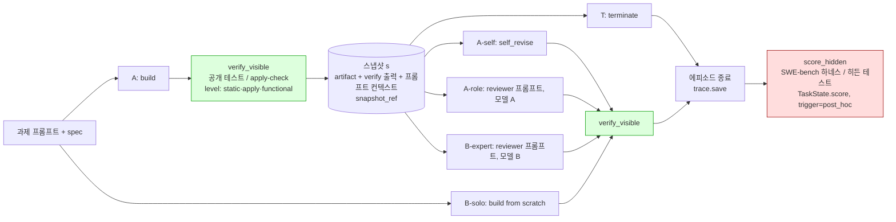

# 2~3주차 실험 설계 초안 (실행하지 않음) — 2026-09-13

상태: **초안, 실행 전 사전 등록 대상.** 숫자로 적힌 통과 기준은 실행 전 고정하고 이후 바꾸지 않는다.

## 0. 실험 질문

> 같은 작업 상태 s 에서 (i) 종료, (ii) 같은 에이전트의 자기 수정, (iii) 다른 모델의 전문가 추가 — 셋 중 어느 것이 나은지가
> **실제로 갈리는 경우가**, 예산을 맞춘 조건에서, 노이즈 바닥 위로 **존재하는가?**

이것은 방법 비교가 아니라 전제의 존재 검증이다(`related_work_week1.md` §3). 갈림이 없으면 REDEREF 대비 차이는 기여가 아니다.
갈림이 있으면 3주차에 "결정 시점 신호로 그 갈림을 예측할 수 있는가"(§14 신호)와 REDEREF 식 사후분포 vs 반사실 실측을 같은 데이터로 비교한다.

## 1. 태스크

| 집합 | 출처 | 용도 | 규칙 |
|---|---|---|---|
| **탐색용** | SWE-bench Lite test **0–29** (데이터셋 순서; 9월 실행과 동일 집합) | 파일럿 3회 반복, 분산·N 산정, 파이프라인 디버깅 | 결과를 보고 설계를 고칠 수 있는 유일한 집합 |
| **확인용** | SWE-bench Lite test **30–59** (인덱스로 지금 지정; 인스턴스 ID 는 2주차 첫날 데이터셋 순서로 해석해 `evidence/week2/confirm_ids.json` 에 동결) | 사전 등록 기준 판정 | **2주차에는 생성·평가·열람 모두 하지 않는다.** 3주차 확인 실행 1회 |
| 보조 | HumanEval 20 + MBPP 20 (G1 집합) | 공개 테스트(doctest)가 있어 `functional` 가시 검증이 가능한 유일한 과제군. SWE 는 가시 검증이 `apply` 수준까지라 두 과제군의 결과를 따로 보고 | 확인용 없음 (탐색만) |

**전문가가 이길 과제만 사후 선별하지 않는다.** 인스턴스 집합은 위 인덱스로 고정. 실패한 인스턴스도 분모에 남는다(생성 실패 = 해당 arm 실패).

## 2. 실험 arm (§10) — 모두 같은 스냅샷 s 에서 재개

A = builder 모델, B = A 와 **다른** 모델 (§5). s = A 가 1회 build 하고 `verify_visible` 을 돌린 직후 상태.

| arm | s 이후 행동 | 모델 | 역할 프롬프트 | 무엇을 분리하는가 |
|---|---|---|---|---|
| **T** terminate | 없음. s 의 산출물 제출 | — | — | 기준선. "A 단독" 대조군과 동일 |
| **A-self** self_revise | A 가 자기 산출물 + 가시 검증 출력을 보고 수정 | A | builder | 자기 수정의 이득 |
| **A-role** expert-role | A 가 **reviewer 프롬프트**로 리뷰·수정 | A | reviewer | 전문가 프롬프트의 좋은 지침을 같은 모델에 옮긴 대조군 — 모델 이질성 없이 프롬프트만 |
| **B-expert** expert_review | B 가 reviewer 프롬프트로 리뷰·수정 | B | reviewer | 모델 이질성 + 프롬프트. A-role 과의 차이 = 모델 이질성의 순기여 |
| **B-solo** | B 가 처음부터 build (s 사용 안 함) | B | builder | "협업"이 아니라 그냥 더 좋은 모델을 썼을 때 |
| **A-solo** | = T (A 가 처음부터 1회) | A | builder | T 와 동일 실행. 별도 arm 으로 세지 않고 표에 병기 |

모든 arm 에 같은 정보·같은 도구: 산출물, `verify_visible` 출력 전문, 과제 프롬프트, 같은 `spec`. 히든 채점 정보는 어떤 arm 에도 없다(§15).
v1 키워드 repair 경로·`eval_repair` 는 전 arm 에서 꺼진 상태(`G1_DISABLE_EVAL_REPAIR` 기본, `HARMONET_REPAIR_KEYWORD_THRESHOLD=0` 또는 v2/single 어댑터만 사용).

## 3. 예산 (§11)

- **주 예산 = USD**, `harmonet/pricing.py` 의 `prices_2026-09` 스냅샷으로 계산. 토큰·wall_ms 는 항상 같이 보고(`Action.cost`).
- 계속 arm(A-self, A-role, B-expert)의 **추가 예산**은 동일 상한 $b_cont 로 맞춘다. b_cont = 파일럿에서 잰 B-expert 1회 호출 비용의 중앙값(§4 파일럿에서 확정, 예상 $0.02~0.04). 상한을 넘기는 호출은 max_tokens 로 잘리지 않고 **실행 전에 예산 초과로 거부** → 해당 arm 실패로 기록.
- B-solo 는 T + b_cont 와 같은 총예산.
- **예산 강제 소진 없음**: arm 이 상한보다 적게 쓰면 그대로. 보고는 "이득 / 실제 지출".
- A 와 B 의 단가가 다르므로 같은 $ 에서 B 는 토큰을 적게 쓴다 — 이것이 $ 를 주 예산으로 두는 이유이며 결과 해석에 명시.

## 4. 노이즈·표본 크기·판정 (§12)

1. **파일럿**: 탐색용 30 인스턴스 × 6 arm × **3회 반복** (같은 설정). 반복 간 히든 통과 여부 뒤집힘 비율로 arm 별 노이즈 바닥 추정.
2. **최소 효과 크기(MDE)**: 사전 등록값 **Δ = 10pp** (arm 간 인스턴스 단위 히든 통과율 차이). 이보다 작은 차이는 "구별되지 않음"으로 보고.
3. **N 산정**: 파일럿 분산(과제 단위, 반복은 독립 표본으로 세지 않음)과 Δ=10pp, α=0.05(양측), power 0.8 로 확인용 N 과 반복 수를 계산해 `evidence/week2/power.json` 에 기록. 확인용은 30개로 고정돼 있으므로 N 이 30 을 넘으면 **"이 설계로는 Δ=10pp 를 검출할 수 없음"을 그대로 보고**하고 확인 실행을 하지 않는다.
4. **oracle 교차 적합**: 인스턴스별 최선 arm 을 **반복 집합 1** 에서 고르고 **반복 집합 2** 에서 평가. 같은 반복에서 고르고 평가하면 선택 편향(승자의 저주)이 생기므로 금지.
5. **귀무분포**: 인스턴스 안에서 arm 라벨을 순열(10,000회)해 "oracle 이득"의 귀무분포를 만든다. 관측 이득(교차 적합)이 귀무분포의 **95 백분위**를 넘고 **Δ ≥ 10pp** 일 때만 "갈림이 존재"로 판정.
6. **CI**: 과제 단위 부트스트랩(n = 인스턴스 수), 반복은 과제 안에 중첩.
7. **통과 기준(사전 등록)**: 확인용 집합에서 (a) 교차 적합 oracle 이득 ≥ 10pp, (b) 순열 p < 0.05, (c) 노이즈 바닥(같은 arm 반복 간 뒤집힘) < 그 이득의 절반. 셋 다 만족해야 통과. 하나라도 실패하면 "존재 미확인".

## 5. 모델 이질성과 비용 추산

| 역할 | 모델 | 단가(in/out per MTok) | 근거 |
|---|---|---|---|
| A (builder) | `claude-haiku-4-5` | $1 / $5 | 9월 SWE 실행과 동일, 43/50 체인과 같은 계열 |
| B (reviewer) | `claude-sonnet-4-6` | $3 / $15 | 같은 제공자·같은 API 형식, A 와 명백히 다른 모델. `HARMONET_MODEL_REVIEWER` |

대안 검토: 7B(로컬, $0)→haiku 는 $ 예산이 무의미해지고 7B 는 SWE 에서 0/10 이라 s 자체가 쓸모없음(`evidence/swe_fair/pilot_7b`). 기각.

비용 추산(파일럿, 탐색용 30 × 3회): 인스턴스당 프롬프트 ~4k 토큰, 출력 ~1k.
- T/A-solo: $0 추가 (s 생성 비용 30×3×~$0.01 = **$0.9**)
- A-self, A-role: 각 30×3×~$0.012 = **$1.1** ×2
- B-expert: 30×3×~$0.04 = **$3.6**
- B-solo: 30×3×~$0.03 = **$2.7**
- 합계 ≈ **$9.4** (+ Docker 채점 시간 ≈ 6 arm × 90 예측 = 540 인스턴스 평가, 이미지 30개 캐시됨 → ~1.5시간)
확인 실행(3주차, 30 × 반복 수 r): ≈ $3.1 × r.

## 6. 검증기 위치 (§15) — 루프 안은 `verify_visible` 뿐, `score_hidden` 은 에피소드 종료 후

- 초록 = 루프 안에서 볼 수 있는 유일한 신호. 빨강 = 종료 후에만. `TaskState.score` 가 채워진 뒤 Action 이 추가되면 `save()` 가 거부한다(A7).
- SWE 과제에서 `verify_visible` 은 `level=apply`(패치 적용 여부)까지만 — 테스트 실행은 히든. 따라서 SWE 의 A-self/A-role/B-expert 가 받는 가시 신호는 "적용됐는가 + 적용 오류 텍스트"뿐이다. HumanEval/MBPP 는 doctest 로 `functional` 까지.

## 7. 분기 스냅샷 (§9)

- s 생성 직후 `TaskState.snapshot_ref = evidence/week2/<run_id>/<task_id>/s0/` 에 파일로 저장: `artifact.{py,diff}`, `verify_visible.json`, `prompt_context.json`(과제 프롬프트, spec, 시스템 프롬프트, 모델 A id).
- 모든 계속 arm 은 **디스크의 s0 를 읽어** 재개한다(메모리 상태 재사용 금지 — arm 간 오염 방지). arm 실행 순서는 인스턴스별로 무작위.
- `Action.input_ref` / `Action.output_ref` = 그 행동이 읽은/쓴 파일 경로. 400자 `result_summary` 는 보조.
- 구현은 2주차 첫날 (`harmonet/trace.py` 필드 추가 + `benchmark/arms.py` 신설). 이번 주에는 코드 없음.

## 8. 결정 시점 신호 — 기록만 (§14)

s 에서 다음을 `s0/decision_signals.json` 에 기록하고 **2주차에는 분석하지 않는다** (3주차 예측가능성 분석이 재실행 없이 되도록):
`verify_visible.outcome`, `level`, `n_run/n_passed/n_failed`, `flags`, `applied`, 적용 오류 종류(`_classify_apply_error`), 산출물 길이(chars/lines), 진단 텍스트(오류 tail 300자), A 의 build 비용(토큰·$·wall_ms), 과제 프롬프트 길이.

## 9. 공정성 항목 (week1_notes 반영)

- 전 arm 동일: hints 미포함, `max_tokens` 4096, temperature 0.2, oracle 파일 컨텍스트(SWE) — 표준과 비교 불가 조건임을 명시.
- v1 키워드 repair·`eval_repair` 비활성. LLM 검증(`expert_review`)은 arm 으로만 존재하고 어댑터 내부 자동 호출은 없음.
- A-role 이 있어야 B-expert 의 이득에서 "프롬프트 효과"를 뺄 수 있다. A-role 없이 B-expert > A-self 만 보이면 기여 주장 불가.
- SWE 의 가시 검증은 `apply` 수준 — 이 한계 때문에 HumanEval/MBPP(doctest) 결과를 반드시 병행 보고.

## 10. 실행 환경

- `HARMONET_ALLOW_NO_REDIS=1`(A2 이후 필수), `HARMONET_LLM_BACKEND=anthropic`, `HARMONET_MODEL_BUILDER=claude-haiku-4-5`, `HARMONET_MODEL_REVIEWER=claude-sonnet-4-6`, `ANTHROPIC_MAX_TOKENS=4096`, `ANTHROPIC_TEMPERATURE=0.2`, `HARMONET_TRACE_RUN_ID=week2_pilot_<date>`.
- 채점: WSL `~/swe/bin/python -m swebench.harness.run_evaluation` (`swe_fair/eval.sh`), 인스턴스 이미지 30개 캐시됨. 확인용 30개는 추가 ~90GB.
- 지연 측정에서 `KuraMotoCoupler.step()` 낭비 연산 분리(v1 어댑터 미사용으로 자연 해소; single/v2 만 사용).
- 실험 전 `python -X utf8 scripts/week1_smoke.py` 통과 필수.

## 11. 2주차 첫 작업 (전제 조건)

1. HumanEval docstring `>>>` → doctest 추출 → `spec["tests"]` (공개), 정답 테스트는 `spec["hidden_tests"]` 로만.
2. `snapshot_ref` / `input_ref` / `output_ref` 구현 + `benchmark/arms.py` (6 arm, $ 예산 게이트).
3. 확인용 인스턴스 ID 동결 파일 생성 (열람 없이 ID 만).
4. 파일럿 3회 → `power.json` → N 판정 → 여기 §4 의 숫자로 통과/미통과 사전 등록 재확인.

## 12. 하지 않는 것

- 학습 규칙(밴딧·사후분포·위상 갱신) 추가 — 3주차 이후, 그리고 §0 의 갈림이 존재할 때만.
- 결정 시점 신호 분석 — 3주차.
- 확인용 집합 접근 — 3주차 1회.
